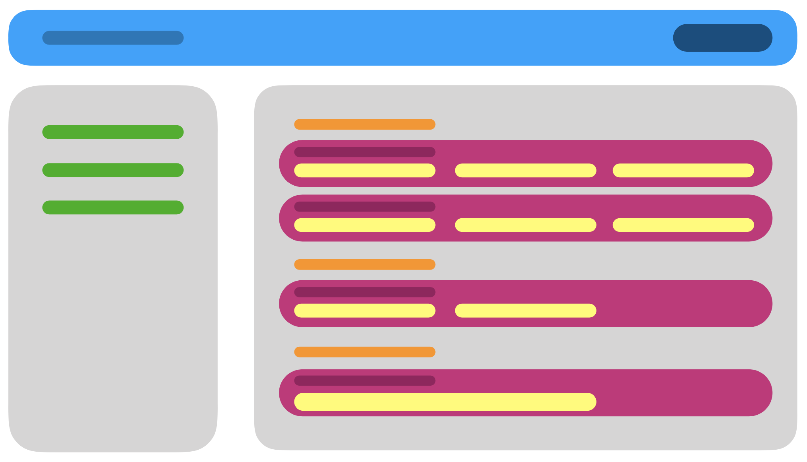

# Form Framework
One of the benefits of the Form Framework tool is that it allows simple coupling of the front- and back-end sides when creating a new form.

----
## Table of Contents

* [Setup for Local development](#setup-for-local-development)
* [Step-by-Step Guide to Create a New Form](#step-by-step-guide-to-create-a-new-form)
* [Modifying an Existing Schema](#modifying-an-existing-schema)
* [Adding a Pivot table Schema](#adding-a-pivot-table-schema)
* [Front-End Architecture Overview](#front-end-architecture-overview)
* [Front-End keywords glossary](#front-end-keywords-glossary)
* [Back-End keywords glossary](#back-end-keywords-glossary)
----

## Setup for Local development
Install the following to run the application locally
  1. Node 10+
  2. Docker
  3. Postgres
  4. GNU make (for windows)

After installation, follow the instructions below to start local development
  1. To install all the dependencies, go to the following folder from the root directory and run either `npm install` or `npm ci`
      - `api/api_sources` - Installs the packages required by the backend node application
  2. Navigate to `api` directory and run either of the following
      - `make local-debug` - To run the application with logs
      - `make run-local` - To start the application in the background and hide the logs
  3. Other handy make commands:
      - `make api` - Shell into the api container. Local api container is customized with all development related CLI tools. Using api container shell is recommended.
      - `make database` - To shell into the database container. As an additional step, the schema needs to be set by running the command given below before running any queries
        ```ts
        SET SCHEMA 'invasivesbc'
        ```
## Step-by-Step Guide to Create a New Form

### 1. Create the .yaml file for the schema
The starting point for a new form is the schema's .yaml file, which specifies the configuration of both front- and back-end components of the form.

  1. If you haven't already done so, install [ts-node](https://www.npmjs.com/package/ts-node) by running `npm install ts-node -g`

  1. Generate a skeleton .yaml file for the schema by running `ts-node api/api_sources/scripts/create.schema.ts -s <Schema-Name>` from the command line. The skeleton .yaml file will be placed within the `api/api_sources/schema-files` directory, with the name of the file matching the specified \<Schema-Name>.  
  Alternatively, rather than creating a new schema file, you can create a new schema by adding it to an existing schema file (multiple schemas can be defined with a .yaml file). This is recommended if 2 or more schemas are related in some logical way.

  1. Begin by populating the preliminary information for the schema:
      - `name:` the name of the table as it will be stored in the DB. Should be in snake-case, with only lowercase letters
      - `description:` a brief description of the schema, which will be stored in the DB as a comment on the table
      - `baseSchema:` if the schema is for a record (user-generated data), the baseSchema should be `RecordSchema`. If the schema is for a code table, the baseSchema should be `CodeTableSchema`
      - `skipVerification:` an **optional** boolean field indicating if the schemaLoader should or should not perform automated validation on the schema
      - `meta:` there are multiple possible fields for this section (all are **optional**).
      - `api:` the string that will be used as an API route, if an API route for the schema is desired. Only the substring that will appear after "/api" should be given here
      - `resource:` default value is false, but this should be set to `true` if you want the Form Framework to automatically generate a controller for the schema (refer to Step 3)
      - `baseModel:` specifies the template of the model that will be automatically generated for the schema (as in Step 3). If the baseSchema (above) is RecordSchema, the baseModel should be `Record`. If the baseSchema is CodeTableSchema, the baseModel should be `ApplicationCode`


  4. Fill in the `columns:` section, which is a list of all columns that should be inserted into the DB's table for the schema. A column to store the primary key for the table is automatically inserted into the .yaml file when the `create.schema.ts` script is used to generate the skeleton (Step 1.2). By convention, the "columns" section is broken up into 2 subsections: the first is for data columns, the second is for relation columns, which consists of foreign key references to other DB tables.  
  Each column is assigned a name unique to the schema, which will be used to refer to the field within the schema (camel-case has been used by convention). Indented underneath each column are a number of field properties.
      - "data" columns may have the following properties specified:
        - `name:` the name of the column as it will appear in the DB, written in lowercase snake-case, by SQL convention. This DB column does not need to exactly match the name of the column in the .yaml file, but the correlation between the 2 names should be obvious
        - `comment:` a brief description of the field, which will be assigned to the DB's column as a comment
        - `definition:` a string of SQL code defining the column (e.g., "VARCHAR(100) NULL", "NUMERIC(4,1) NULL", etc.)
        - `meta:` **optional**. In most cases, this property will likely be null, but may include `embedded: true` to indicate that a component is being injected into the form from another schema
        - `verification:` **optional**. Any validation filters specified here will be applied *only on the front-end* (i.e., these restrictions will not be applied to the column in the DB). The Form Framework currently supports validation for `minimumValue` (input must be &ge; minimumValue); `maximumValue` (input must be &le; maximumValue); and `positive` (input must be > 0)
        - `layout:` **optional**. The layout property typically includes nested properties for the field's header in the front-end (`header.key` and `header.default`) and the CSS `classes:` that should be applied to the field's HTML element. If a `suffix:` should be applied to the field, this will also be indicated in the layout property.
      - "relation" columns may have all the properties listed above (except for verification), and these additional properties:
        - `foreignTable:` the name of the table as it appears in the DB
        - `refColumn:` the name (as it appears in the DB) of the foreign table's reference column (i.e., the reference column will be used as the foreign key)
        - `deleteCascade:` boolean value indicating whether deletion of the foreign key should cause deletion of the entry for the current schema

  5. (**Optional**) If the form should include any computed fields, these fields are configured in the `computedFields:` section of the .yaml file. Computed fields are read-only values that may or may not be stored as a column in the DB. A computed field is configured similarly to the standard fields from the previous step, but with the addition of defined `computationRules:`, which consists of a list of one or more rules defined as follows:

  - `name:` included for convenient reference within the schema config file, but is not used anywhere in the form or DB
  - `keys:` a list of the fields (as they are named in the schema's .yaml file -- i.e., NOT the name of the DB column) that will be used as input parameters for the calculation
  - `method:` the name of the calculation method. The definitions of calculation methods appear in `app/components/base-form/computed-field/computed-field.component.ts`  

  In most cases, the computed field will have units associated with the calculation. The units can be specified with the `suffix:` property as done for all other fields.

  6. Fill out the `layout:` section of the config file with the corresponding fields specified in steps 4 and 5 above. The layout section of the config is only used on the front-end side of the Form Framework, to determine which fields should appear in which subsection, and which subsections should appear in each section of the form. All sections, subsections, and fields will be laid in the form in the same order as they appear in `layout:`. See "Basic Form Structure" (in "Front-End Architecture Overview") for a more detailed explanation of how the sections, subsections, and fields fit together in the form.

  7. (**Optional**). Specify the `displayLabel:` (within the `displayLayout:` configuration) for the schema as a whole. If the schema is for a code table, the `displayLabel:` describes how the code table entries will be displayed in the dropdown. If the schema is for a record, the `displayLabel:` describes how the record can be succinctly described as a "preview" (of sorts).

  - Example: in "efficacyCodes.schema.yaml" (the schema for a code table), we use the following code snippet to indicate that the value for the 'efficacyRating' field in the schema should be listed as a dropdown menu item for each entry of the code table.

  ```yaml
    displayLayout:
      displayLabel: '#(efficacyRating)'  
      header:  
        key: efficacyRating.header  
        default: 'Efficacy %'
  ```    

  - Example: in "observation.schema.yaml" (the schema for a record), we use the following code snippet to indicate that the date and commonName of the species should be used to describe the observation record when it is displayed in the Inventory page of all recorded observations (as an example). The commonName is a field attached to the species, which is a foreign key reference in the observation schema.

  ```yaml
    displayLayout:
      displayLabel: '#(species.commonName) - #(date)'
  ```

  8. (**Optional**). The `relations:` section is used to link multiple schema records together (when necessary).
    - Example: there may be 0 to many mechanical treatments associated with an individual observation. In "observation.schema.yaml", the following code snippet indicates that when 1 or more mechanical treatments refer to a given observation as a foreign key, the linked mechanical treatments should be displayed on the front-end side of the observation record.

  ```yaml
    relations:
      mechanicalTreatments:
        header:
          key: 'observation.mechanicalTreatments'
          default: Mechanical Treatments
        description:
          key: 'observation.mechanicalTreatments.description'
          default: 'Mechanical treatments performed on observation'
        type: array
        relationshipType: many-to-many
        schema: MechanicalTreatmentSchema
        meta:
          embedded: true
  ```

  9. (**Optional**). If the current schema references any other schemas (e.g., as foreign key references), there are two ways to indicate this in the .yaml file for the current schema:

  - `includes:` specifies the dependent schema's .yaml filename
  - `externalTables:` specifies the name of the dependent schema's table in the database  

  Either of these can be used. It is recommended that if a dependent schema is one of multiple schemas within the same .yaml file, `externalTables` makes the dependency to the specific schema more explicit. However, if the .yaml file contains only the dependent schema and no others, using `includes` is a quicker way to refer to the schema.

  10. (**Optional**). If the current schema needs a bunch of data to be seeded initially, it can be done by including the following option in the yaml file.

  ```yaml
  batchImport:
    ObservationSeed:
      fileName: ObservationSeed.csv
      environments: 
        - test
      allColumnsExcept: 
        - observation_id
      mapper:
        observation_comment: general_comment
      groupFields:
        - key: spaceGeom
          fields:
            obs_lat: latitude
            obs_lon: longitude
            radius: radius
  ```
  Some options take precendence over the other, the script first process the `allColumnsExcept`, then the `mapper` is executed and finally it groups the fields mentioned in `groupField`. Fill in the options as mentioned in the example above. 

  - `fileName` - The name of the CSV file to load
  - `environments` - List of environments where the import should happen - dev, test, prod
  - `allColumnsExcept` - The fields mentioned here are not processed during import
  - `mapper` - The key/value pairs to map the existing column value to a different field
  - `groupFields` - Group the `fields` mentioned with a new `key`


### 2. Create the handler for the schema
The handler is used to match the schema class in Typescript to the schema's .yaml config file.

1. Within the `api/api_sources/sources/database/database-schema` directory, create a new file that matches the schema name. Alternatively, a handler class for the schema can simply be appended to an existing file within this directory.

1. The schema handler must specify the name of the .yaml config file that defines the schema - use the `getYAMLFilePath()` method for this.

1. If the baseSchema (specified in the .yaml config) is "RecordSchema", the schema handler should extend `RecordTableSchema`. If the baseSchema is "CodeTableSchema", the schema handler should extend `CodeTableSchema`.

1. (**Optional**). If the schema class is being used to import data from a file (i.e., if the schema is for a code table), the schema handler requires an additional function:
```ts
get hasDefaultValues(): boolean {
    return true;
}
```

### 3. Create the model & SQL file
1. Create a new (empty) sub-directory inside the `api/api_sources/schema-migration-sql` directory. The name of this sub-directory must exactly match the schema name as defined in the .yaml config.

1. Execute the command `ts-node api/api_sources/scripts/schema.manager.ts -s <SchemaName> -m`. Running this script will generate a SQL file inside the sub-directory created in the previous step. This generated SQL file will create and configure the schema's table in the DB. This same script will also generate a Typescript file (with the same \<SchemaName>) inside `api/api_sources/sources/database/models/`.

1. Typically, the schema model file will require minor refactoring (e.g., removing unnecessary imports, etc.).

4. Add the generated controller and model to the list of exports in `api/api_sources/sources/database/models/index.ts`


### 4. (Optional) Import data from CSV
1. If the new schema is for a record, this step can be skipped. However, if the new schema is for a code table, at this point we must integrate the CSV file for the source data with the schema. First, add the CSV file to the repo in the `api/api_sources/resources/csv/` directory.

2. In the schema's .yaml config file, point to the source CSV file by adding the following code snippet at the first child level within the schema:

```yaml
imports:
  init:
    fileName: <filename>.csv
    allColumns: true
```

  The "init" label serves as a version name for the import. Updated versions of the source file can be added later by appending a new version name (and a modified CSV file) to the list of imports. The `allColumns:` property indicates that every column in the schema should be imported into the DB. If this is not desired, specific columns can be selected for import into the DB by replacing "allColumns" with `entryColumns:` and listing the names of the columns to be imported. To ignore certain columns from the CSV file, list them under the `ignoreDataColumns`

3. Run the schema-manager script to generate a new SQL file that will insert the CSV data into the schema's table in the DB. To run this script, execute `ts-node api/api_sources/scripts/schema.manager.ts -s \<SchemaName> -m` from the command line.


### 5. Create SQL migration file using TypeORM script

The purpose of this step is to generate a SQL migration file so that the schema's table can be migrated to the DB.

1. If not already, shell into the Docker container for the API/back-end.

1. Create an empty sub-directory within `api/api_sources/schema-migration-sql`. The name of this new directory must exactly match the name of the new schema.

1. Execute `typeorm migration:create -n <nameOfMigrationFile>` from the command line (within the API Docker container). Running this script will generate the SQL migration file and a Typescript file in `api/api_sources/database/migrations`. The \<nameOfMigrationFile> should describe what changes are being implemented to the DB (e.g., "CreateEfficacyCodes", "UpdateChemicalTreatmentSchema", etc.)

  **Hint:** *If the typeorm migration script fails to execute with a "File Not Found" error, it's most likely because the sub-directory from the previous step doesn't exist or hasn't been named correctly.*

  The selected name of the migration file (both the SQL and Typescript files) will be prefixed with a string of digits, representing the timestamp for the creation of the file. This is in accordance with TypeORM's naming convention for creating migration files, and is used to indicate which order the migration files should be run in.

1. The generated Typescript file will require some minor modifications (this is a script provided by TypeORM itself, so we aren't able to edit it to make these corrections programmatically):
  - the class should extend AppDBMigrator
  - declare an instance of the schema within the class
  - write a `setup()` method. If creating a new schema, create an instance of the schema within the setup() method and add the "init" version of the schema to the migrator using
  ```ts
  this.addSchemaInitVersion(this.<SchemaName>);
  ```  
  Otherwise, if modifying an existing schema, add the updated version of the schema using
  ```ts
  this.addSchemaVersion(this.<SchemaName>, <versionName>);
  ```  
  If also migrating a data file into the schema, you must also add the data import migration to the setup() method:
  ```ts
  this.addDataImportMigration(this.<SchemaName>, 'init');
  ```
  The second parameter in this call is the version name - use 'init' when creating a new code table, any other version name when updating an existing code table.

  - complete the `up()` and `down()` methods to specify the desired process for upgrading and downgrading the schema in the DB. Note that if the migration file is creating a new table in the DB ("init" version), the down() method should simply drop the table. If the migration file is modifying a pre-existing DB table, the down() method should call downMigrations().
    - Example: from CreateMechanicalMonitor.ts  
    ```ts
    await queryRunner.query(this.mechanicalMonitorSchema.dropTable());
    ```
    - Example: from RecordUpdate.ts
    ```ts
    await this.runQuerySqlFiles(this.downMigrations(), queryRunner);
    ```

### 6. Run DB migration

1. If not already, shell into the Docker container for the API/back-end.

1. From the command line, execute `npm run migration`. If any errors occur when running this script, you can view the debug log for the script by running the command `npm run migration DB_LOG=yes`.

1. If the migration has run successfully, the DB has now been updated to include the new/modified schema(s).

### 7. Add new route(s) to router service
If the created schema is for creating a new form, at this stage the page will exist but will not be accessible because no route exists for it yet.

1. Add the desired route name(s) to `src/app/constants/app-routes.enum.ts`.

1. Incorporate the route name(s) into the RouterService in `src/app/services/router.service.ts`. The new routes need to be added as switch cases to the `resolveCreateRoute()`, `resolveEditRoute()`, `resolveViewRoute()`, and `getAppRouteForAPI()` methods in this service.

### 8. Write unit tests for schema

Unit tests for the schemas and controllers are located within the `api/api_sources/sources/database/__tests__` directory.

Here are some tips for writing unit tests:
- as a starting point, write a unit test to assert that the schema's new table can be fetched from the DB
- to randomly select an element from a table with pre-populated data in it, use `<controllerName>.shared.random()`
- the `ModelSpecFactory` can be used to create an instance of a dependent object that is required to test the target object
- to run the unit tests:
  - make sure you have re-built the backend code (`make local-debug`),
  - then shell into the Docker container for the backend,
  - then run `npm run test:all` to run all unit test files, or `npm test sources/database/__tests__/<filename>.spec.ts` to only run the unit tests located in one specific file

## Modifying an Existing Schema
If the modifications to an existing schema are **only on the front-end** (i.e., the database schema does not need to be modified), once the schema's .yaml file has been modified, save the .yaml file and a random .ts file in the /api directory. No actual modifications to the random .ts file are required, but the action of saving a .ts file will fire a re-compilation when running the application locally.

The steps required to modify a schema when **back-end changes** are involved will vary depending on the nature of the modifications. At the very least, it will be necessary to re-run `npm run migration` within the Docker api-container. Other steps before this may be necessary - refer to the Step-by-Step Guide for Creating a New Form to see what commands are necessary for each step of the process.

### Creating a version for Schema modifications
Follow these steps to add versioning for any schema modifications(Alter/Drop). Create a new field named `versions` under the `schemas` section in the yaml file. Once the changes are made, follow from Step 3 in Step-by-Step Guide to generate the SQL file for these schema changes. A new migration file needs to be added.

The following fields can be specified in this section.
  - `name`: The desired name for the version
  - `id`: The Id for the version
  - `info`: A small description about the version
  - `columns`: This section is to add any new columns to the database and it can have the following fields inside
  ```yaml
    columnName:
      name: Name of the column
      definition: Column definition indicating the type and other constraints
      comment: A short description about the column
  ```
  - `schemaChanges`: This section is to modify any existing columns

    - To rename a column
    ```yaml
      comment: A short description of what the change is about
      type: rename
      existingKey: The name of the column that needs to be modified
      newColumnName: The new column name
    ```
    - To modify a column
    ```yaml
      comment: A short description of what the change is about
      type: update
      existingKey: The name of the column that needs to be modified
      columnName:
        name: Name of the column
        definition: Column definition indicating the type and other constraints
        comment: A short description about the column
    ```
    - To delete a column
    ```yaml
      comment: A short description of what the change is about
      type: drop
      existingKey: The name of the column that needs to be dropped
    ```

## Adding a Pivot table Schema
Often times, the tables in a relational database tend to have a foreign key reference to one or more tables. The backend comes integrated with a Postgres DB using TypeORM.

TypeORM supports the following relationships,
  - One-to-One
  - One-to-Many
  - Many-to-One
  - Many-to-Many

A Many-to-Many relationship requires a pivot table which has a reference to the two entities involved. To create a pivot schema, follow these instructions

  - Generate a skeleton .yaml file for the schema by running `ts-node api/api_sources/scripts/create.schema.ts -s <Schema-Name>` and fill out the following fields
    ```yaml
      version: version number
      description: A short description about the schema
      includes: The list of yaml filenames containing the schema of external tables involved
      schemas:
        pivotSchemaName:
          name: The name of the pivot table
          description: Description about the pivot table
          columns:
            id:
              name: The name of the primary column
              comment: Auto generated sequential primary key column.
              definition: SERIAL PRIMARY KEY
            firstColumnName:
              name: The name of the column
              comment: A comment about the reference used
              definition: Column definition indicating the type and other constraints
              foreignTable: The name of the referenced foreign table
              refColumn: The column in the foreign table being referenced
              deleteCascade: Action on delete
            secondColumnName:
              name: The name of the column
              comment: A comment about the reference used
              definition: Column definition indicating the type and other constraints
              foreignTable: The name of the referenced foreign table
              refColumn: The column in the foreign table being referenced
              deleteCascade: Action on delete
    ```
  - Follow the instructions from Step 2 in the Step-by-Step guide
  - A SQL file and a model file will be created after Step 3. Keep the SQL file and delete the model file. If not deleted, the model file will cause issues and throw unexpected errors.
  - Use `observation.ts` and `mechanical.treatment.ts` under the models folder in the database as a reference to implement Many-to-Many relationship

  ```ts
    @ManyToMany(type => MechanicalTreatment, mechanicalTreatment => mechanicalTreatment.observations)
    mechanicalTreatmentsFetcher: Promise<MechanicalTreatment[]>;
    @ModelProperty({type: PropertyType.array, $ref: '#/definitions/MechanicalTreatment'})
    mechanicalTreatments?: MechanicalTreatment[];
  ```

  ```ts
    @ManyToMany(type => Observation, observation => observation.mechanicalTreatmentsFetcher, { eager: true} )
    @JoinTable({
        name: MechanicalTreatmentObservationSchema.dbTable,
        joinColumn: {
			name: MechanicalTreatmentObservationSchema.columns.mechanicalTreatment,
            referencedColumnName: MechanicalTreatmentSchema.id
        },
        inverseJoinColumn: {
            name: MechanicalTreatmentObservationSchema.columns.observation,
            referencedColumnName: ObservationSchema.id
        }
    })
    @ModelProperty({type: PropertyType.object})
    observations: Observation[];  
  ```


## Front-End Architecture Overview
### Overall Structure
The structure of a form page consists of a **header/nav-bar**, a **side menu** for navigation with the page, and the **main body** of the form. The overall appearance of the screen is as follows:



### Header/Nav-bar

The **title** in the header is a string whose value is set in the configuration file for the page. The title can vary for each form.

On the right side of the header is a location for 1-2 buttons. Which buttons are shown depends on the current FormMode.

**In FormMode.Create:**
 - if inReviewMode === False, the user is in the process of writing data to create a new record. Only the "Submit" button is displayed. Clicking this button will prompt the front-end to perform a check that all required fields are completed and valid. If so, the inReviewMode flag will be set to True, prompting a redirect to a view-only version of the form data. At this point, the form data has not been sent to the database.
 - if inReviewMode === True, the "Commit" and "Make Changes" buttons will be displayed. "Make Changes" resets the inReviewMode flag to False, and renders an editable view of the form data. The "Commit" button causes the form to be submitted to the backend, and the user will be redirected to the FormMode.View version of the form.


**In FormMode.View:**
- only the "Make Changes" button is displayed. Clicking this button redirects the user to the FormMode.Edit version of the form

**In FormMode.Edit:**
- if inReviewMode === False, the user is in the process of writing data to edit an existing record. As in FormMode.Create, only the "Submit" button is displayed.
- if inReviewMode === True, the "Commit" and "Make Changes" buttons are displayed. The behaviour of these buttons matches that described in FormMode.Create


### Basic Form Structure

There can be 1-n sections in the form body. The title of each section (specified in the configuration file) will be displayed as a menu item in the side menu, to allow the user to navigate within the page. Section titles are not strictly required but are strongly recommended. Each section is divided by a horizontal divider bar.

Within each section there can be 1-m subsections. Subsection titles are set in the config file, but are entirely optional.


Each subsection may contain 1-p fields. There are 8 different field types built into the framework tool


## Front-End keywords glossary

**Layout:** a nested list of front-end layout elements for a particular field. The keyword `layout:` should appear as the first-level descendant of the relevant field under the `columns:` section of the .yaml file.

| Layout keyword | Description |
|----------------|-------------|
| `header:`      | Two children can be placed in this section: `- key:` indicates the key-lookup ; `- default:` is the default header that will be used if a value for the key does not exist. |
| `suffix:`      | A string that will be appended to the end of the input field as a read-only Material-UI suffix (matSuffix). Typically used for units (e.g., 'm', '&deg;C', etc.) |
| `classes:`     | The names of CSS classes that should be applied to the HTML element in the form.|

  - The form framework interprets the `classes` and categorize it under four different variables
      - create: Styles for create mode
      - edit: Styles for edit mode
      - view: Styles for view mode
      - common: The common styles for all modes
  - A sample structure for classes is given below
    ```yaml
    classes:
      - <common-classname-1>
      - <common-classname-2>
      - mode: create | edit | view
        classNames: 
          - <classname-1>
          ...
    ```
  - Using `none` allows the Form Framework tool to automatically configure the CSS classes for the element
    ```yaml
    classes:
      - none
    ```


**Verification:** a list of keywords that will be used to perform **front-end validation** on the input for a particular field. The keyword `verification:` should appear as the first-level descendant of the relevant field under the `columns:` section of the .yaml file.  

| Verification keyword | Description |
|----------------------|-------------|
| `maximumValue: x`    | Error message will appear underneath field in form if the input value is > x. I.e., input must &le; x |
| `minimumValue: x`    | Error message will appear underneath field in form if the input value is < x. I.e., input must &ge; x |
| `positive`           | Error message will appear underneath field in form if the input value is &le; 0. |


## Back-End keywords glossary

**Comment:** a string that will be used to add a comment to the column in the database schema. The comment should describe the purpose/usage of the column.

**Definition:** The definition of the column in SQL language. It is strongly recommended that `NULL` or `NOT NULL` is explicitly stated in this definition.

**Meta:** a list of optional keywords:

| Meta keyword | Description |
|--------------|-------------|
| `api:`       | The string that will be used as an API route, if an API route for the schema is needed. Only the substring that will appear after "/api" should be specified |
| `baseModel:` | specifies the template of the model that will be automatically generated for the schema. If the baseSchema is "RecordSchema", the baseModel should be `Record`. If the baseSchema is "CodeTableSchema", the baseModel should be `ApplicationCode` |
| `resource:`  | if set to `true`, the Form Framework will automatically generate a controller for the schema |

**Name:** the name that will be assigned to the column in the database. Should be all lowercase letters, with words separated by underscores (snake-case).
