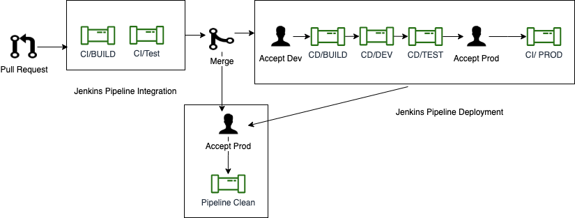

# Invasives BC Pipeline

Invasives BC automatic Jenkins pipeline check code integrity (Continuous integration) and perform deployment to various environment (Continuous deployment).  
  
## Steps

* Create Pull Request in GitHub.

* Automatic pipeline continuous integration stages (Build and Test) will invoke. CI stages check integrity of new code, must finish with success.

* Merge Pull Request in GitHub.

* Accept Dev/Test Deployment in Jenkins.

* Accept Prod Deployment in Jenkins.

* Accept cleaning of PR related assets from OpenShit.

## Various Pipeline Stages

### BUILD

Build Stage build application from Pull Request(PR) source branch. This is a parallel collection of **Build API** and **Build APP** stages.  

### Test Stages

#### Pre-deploy Stage

Pre-deploy stages, setup Database for testing. This stage includes process like

1. Deploy test database.
2. Run migration or setup database.
3. Run seeder.

#### Test Stage

Run tests with SonarQube Analysis.

### BUILD DEV/Test

This is manually accepted stage, mainly create static dev branch build images for deployment. This and __Deploy Dev__ and __Deploy Test__ stages will invoke if PR target is dev branch.

### Deploy Dev

Deploy static dev branch images to dev env. Steps are

1. Deploy DB
2. Run DB Backup.
3. Migrate DB
4. Run Seeder.
5. Deploy API.
6. Deploy Tools (SchemaSpy).
7. Deploy APP.

### Deploy Test

Deploy static dev branch images to test env. Steps are

1. Deploy DB
2. Run DB Backup.
3. Migrate DB
4. Run Seeder.
5. Deploy API.
6. Deploy Tools (SchemaSpy).
7. Deploy APP.

### Deploy Prod

This is a manually accepted stage. This stage deploy with creation of Pull Request with **prod** as target branch. __Deploy Prod__ stage will deploy Pull Request specific image to production env. Steps are

1. Deploy DB
2. Run DB Backup.
3. Migrate DB
4. Deploy API.
5. Deploy Tools (SchemaSpy).
6. Deploy APP.

__**N.B: Standard process of production deployment is to create a Pull Request with dev as source branch and prod as target branch**__
