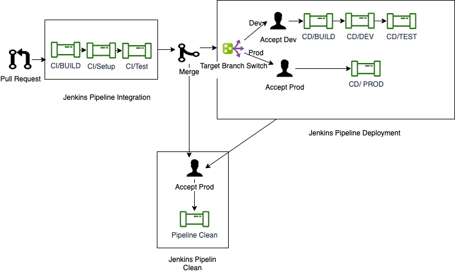

# Invasives BC Pipeline

Invasives BC automatic Jenkins pipeline check code integrity (Continuous integration) and perform deployment to various environment (Continuous deployment).  
  
## Steps

* Create Pull Request in GitHub.

* Automatic pipeline continuous integration stages (Build and Test) will invoke. CI stages check integrity of new code, must finish with success.

* Merge Pull Request in GitHub.

* Accept Dev/Test Deployment in Jenkins.

* Accept Prod Deployment in Jenkins.

* Accept cleaning of PR related assets from OpenShift.

## Various Pipeline Stages

### BUILD (CI)

Build Stage build application from Pull Request(PR) source branch. This is a parallel collection of **Build API** and **Build APP** stages.  

### Test Stages (CI)

#### Pre-deploy Stage

Pre-deploy stages, setup Database for testing. This stage includes process like

1. Deploy test database.
2. Run migration or setup database.
3. Run seeder.

#### Test Stage

Run tests with SonarQube Analysis.

#### Security Scan

Whenever a new PR is created or a new commit is pushed to an existing PR, a dynamic security scan will be performed on the DEV environment (https://dev-invasivesbc.pathfinder.gov.bc.ca/) using OWASP Zap's baseline scan. The results of the scan will be displayed on the PR's page in GitHub.

OWASP Zap and GitHub Actions will automatically create a new Issue for any security vulnerabilities discovered during the scan.

* Note that currently the GitHub Action zap-scan (https://github.com/bcgov/lucy-web/blob/dev/.github/workflows/zap-scan.yml) is configured to `continue-on-error: true` due to a bug in GitHub Actions regarding import of the `octokit/rest` package. This line can be removed once GitHub fixes the bug. In the meantime, it should not affect the actual output of the Zap scan.*

### BUILD DEV/Test (CD)

This is manually accepted stage, mainly create static dev branch build images for deployment. This and __Deploy Dev__ and __Deploy Test__ stages will invoke if PR target is dev branch.

### Deploy Dev (CD)

Deploy static dev branch images to dev env. Steps are

1. Deploy DB
2. Run DB Backup.
3. Migrate DB
4. Run Seeder.
5. Deploy API.
6. Deploy Tools (SchemaSpy).
7. Deploy APP.

### Deploy Test (CD)

Deploy static dev branch images to test env. Steps are

1. Deploy DB
2. Run DB Backup.
3. Migrate DB
4. Run Seeder.
5. Deploy API.
6. Deploy Tools (SchemaSpy).
7. Deploy APP.

### Deploy Prod (CD)

This is a manually accepted stage. This stage deploy with creation of Pull Request with **prod** as target branch. __Deploy Prod__ stage will deploy Pull Request specific image to production env. Steps are

1. Deploy DB
2. Run DB Backup.
3. Migrate DB
4. Deploy API.
5. Deploy Tools (SchemaSpy).
6. Deploy APP.

__**N.B: Standard process of production deployment is to create a Pull Request with dev as source branch and prod as target branch**__

## Note for Pull Request Owner

Followings are responsibility of Pull Request (PR) owners

* Make sure all CI stages should run with success.
* Merge Pull Request before accepting any deployment stages (except prod deployment).
* Deployment of Dev/Test/Prod Env.
* **Acceptance for cleaning stag**.
* If any continuos deployment process fail,
    1. Reopen PR.
    2. Fix issue.
    3. Ask for fresh review.

## Note for Pull Request Reviewer

Followings are responsibility of Pull Request (PR) reviewer

* Review code under Code Review Guideline
* Before accepting any PR, make sure all CI stages (BUILD CI, Test CI) executed successfully.
